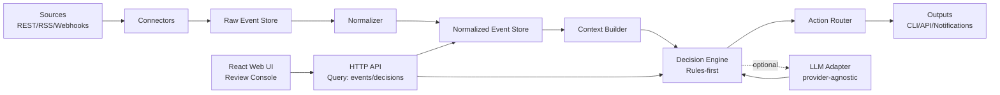

# Signal → Decision → Action (SDA) Platform

A small but realistic **platform / systems architecture** project: ingest signals from free public sources, normalize into a common schema, construct grounded context, run **rules-first decisioning** with an optional **pluggable LLM**, then produce actions/outputs (CLI/API/notifications).

This repo is intentionally optimized for **system design tradeoffs, boundaries, and evolution**, not model quality or UI.

## Goals

- **Signals**: ingest from multiple free/public sources (REST, RSS, webhooks, scraping as last resort).
- **Normalization**: map raw inputs to a stable common event schema.
- **Context**: enrich events with grounded metadata and history.
- **Decisions**: rules first; LLM second; provider-agnostic + swappable.
- **Actions**: produce clear outputs (API/CLI/notifications) with auditability.
- **Constraints**: zero/near-zero budget; free-tier-friendly; clarity over completeness.

## Non-goals

- Academic ML training pipelines
- Heavy UI (we may add a **small React “review console”**, but no complex product UI)
- Microservices/k8s “because it’s cool”
- LeetCode-style problems

## Conceptual Architecture

### Core flow

1. **Ingest** raw signals from sources (polling, RSS, webhooks).
2. **Normalize** into a stable schema (`SignalEvent`).
3. **Store** raw + normalized (append-only) for replay/debugging.
4. **Construct context** (dedupe, entity resolution, recent history, factual lookups).
5. **Decide** using a rules engine; optionally call an LLM via adapter.
6. **Act** by producing outputs (CLI/API/notifications) with traceability.

### Components & responsibilities

- **Source Connectors (Ingestion)**
  - Pull/push integration: REST pollers, RSS fetchers, webhook receivers.
  - Handle auth (if any), rate limits, backoff, pagination, and incremental cursors.
  - Emit raw payloads + minimal metadata (source, timestamp, request id).

- **Normalizer**
  - Convert heterogeneous raw payloads into **one canonical event schema**.
  - Preserve raw payload for auditability; normalization must be deterministic and testable.

- **Event Store**
  - Append-only persistence for: raw payload, normalized event, processing status.
  - Enables replay, debugging, and backfills without re-calling upstream sources.
  - MVP can be SQLite; later can become Postgres.

- **Context Builder**
  - Enrichment: dedupe, mapping to entities, linking to recent related events.
  - “Grounded context” = only facts from stores / fetchers you control.
  - Produces a `ContextBundle` used for decisioning (structured, not just text).

- **Decision Engine (Rules-first)**
  - Deterministic rules for common cases (thresholds, allow/deny lists, heuristics).
  - Optional LLM decision step for summarization or classification, gated by cost/latency policy.
  - Output is a `DecisionRecord` containing: decision, rationale, evidence, confidence, and trace ids.

- **LLM Adapter (Provider-agnostic)**
  - Single interface for chat/completions with pluggable implementations.
  - Supports: local models, free-tier APIs, mock provider for tests.
  - Must support timeouts, retries, and token/cost accounting hooks.

- **Action Router**
  - Routes `DecisionRecord` to sinks: CLI output, REST API response, email/Discord/Slack webhook.
  - Ensures idempotency: “don’t notify twice for same decision.”

- **Web UI (React review console)**
  - Read-only (or minimally write) UI for exploring signals, context, and decisions.
  - Focused on: search/filter, timelines, decision detail pages, and “why” explanations.
  - Talks to the system via a thin **HTTP API**; no business logic in the frontend.

- **Observability & Ops**
  - Structured logs with correlation ids; minimal metrics (ingest lag, error rates, LLM calls).
  - Dead-letter handling for failed events; replay support.

### Logical diagram



## Canonical Data Contracts (first-class)

These types should be stable early; everything else can evolve around them.

- **`SignalEvent`** (normalized input)
  - `event_id` (stable hash or UUID)
  - `source` (connector name)
  - `observed_at` (when it happened)
  - `ingested_at` (when we got it)
  - `entity_keys` (optional: ticker, repo, CVE id, etc.)
  - `type` (event category)
  - `attributes` (typed-ish map; avoid dumping unbounded text)
  - `raw_ref` (pointer to raw payload in store)

- **`ContextBundle`** (grounded context)
  - `event` (the current `SignalEvent`)
  - `recent_history` (related normalized events)
  - `facts` (lookups you control: cached HTTP fetches, local reference data)
  - `derived_features` (counts, deltas, risk scores)

- **`DecisionRecord`** (decision output)
  - `decision_id`
  - `decision_type` (e.g., `summarize`, `alert`, `ignore`, `recommendation`)
  - `decision` (structured payload)
  - `rationale` (human-readable explanation)
  - `evidence` (links to facts + events used)
  - `confidence` (rule-based score; LLM confidence is not trusted blindly)
  - `trace` (correlation ids, timing, errors, llm usage)

## Module Boundaries (clean seams)

The project is easiest to evolve if you enforce these boundaries early:

- **`connectors/`**: one folder per source; no business logic; emits raw + minimal metadata.
- **`normalization/`**: canonical schema + deterministic mappers per connector.
- **`storage/`**: event store interfaces + implementations (SQLite first).
- **`context/`**: enrichment, dedupe, entity resolution, factual fetchers + caching.
- **`decision/`**: rule engine, policies, decision types; calls LLM via interface only.
- **`llm/`**: provider adapters + prompt templating utilities + mock provider.
- **`actions/`**: sinks (CLI, HTTP API, webhooks) + idempotency.
- **`runtime/`**: orchestration (scheduler/worker), config, dependency wiring.

## Architectural Choices (technologies)

These choices prioritize clarity, low cost, and strong architectural boundaries over hype.

- **TypeScript (backend)**
  - Provides static typing on the server, catching API/data-shape issues earlier than runtime.
  - Shares types across layers and improves refactoring safety as the model evolves.
  - Runs on Node.js, which keeps tooling and language consistent across front and back.

- **Fastify (API)**
  - Minimal, fast HTTP server with clear routing and good TypeScript ergonomics.
  - Keeps the API explicit and lightweight for a small MVP.
  - Built-in schema hooks and plugin model make validation and extension straightforward.

- **SQLite (storage)**
  - Zero-config local database, ideal for a single-user MVP.
  - Easy upgrade path to Postgres later without changing boundaries.
  - Data persists to a local file (`sda.sqlite` by default), so state survives restarts.

- **React + Vite (web UI)**
  - Lightweight front-end for a small interactive “review console.”
  - Fast local iteration with minimal build config.

- **Zod (runtime validation)**
  - Validates API inputs at the boundary to keep the decision logic predictable.

- **Stooq CSV (market data)**
  - Free daily close data for ETFs, no auth required.
  - “Good enough” for drift monitoring in a zero-budget project.

- **Rules-first decision engine**
  - Deterministic and testable; LLMs (optional) are behind an adapter and used for summarization only.

## Key Tradeoffs (and why)

- **Polling vs webhooks**
  - Polling is simpler and free-tier-friendly but adds latency and rate-limit pressure.
  - Webhooks are near-real-time but require reachable infrastructure (harder on $0 budget).

- **SQLite vs Postgres**
  - SQLite is perfect for MVP and local dev; limited concurrency.
  - Postgres unlocks multi-worker scaling and stronger query patterns.

- **Rules-first vs LLM-first**
  - Rules are cheaper, faster, testable, and predictable.
  - LLMs are flexible but introduce cost, latency, and nondeterminism; use behind a policy gate.

- **Append-only event log**
  - More storage, but buys replay/debugging and simpler failure recovery.

## Failure Modes & Mitigations

- **Upstream rate limits / downtime**
  - Backoff, caching, incremental cursors, circuit breakers per connector.

- **Duplicate events**
  - Stable `event_id` hashing + idempotent storage + action idempotency keys.

- **Schema drift**
  - Version the canonical schema; per-connector mapper tests using captured fixtures.

- **LLM timeouts / hallucinations**
  - Hard timeouts, retries with jitter, fall back to rules-only.
  - Ground LLM with `ContextBundle` facts; require evidence references; never auto-execute risky actions.

- **Poisoned/untrusted inputs**
  - Treat all signals as untrusted; sanitize; enforce size limits; store raw separately.

## Minimal MVP Scope (ship in days, not weeks)

### MVP use case (concrete)

Pick **one domain** and do it end-to-end:

- **Security watch**: ingest CVEs via RSS/REST + GitHub Security Advisories; decide “relevant to my stack?”; output summary + priority.
  - or
- **DevOps feed**: ingest GitHub repo releases + status pages RSS; decide “notify when major version/incident”; output digest.

### MVP features

- **Two connectors**: 1 RSS + 1 REST poller
- **Canonical schema**: `SignalEvent`, `DecisionRecord`
- **SQLite store**: raw + normalized + decisions
- **Rules engine**: simple deterministic rules (keywords, thresholds, allowlist/denylist)
- **Optional LLM summarizer**: behind a feature flag + budget limit
- **CLI output**: `ingest`, `decide`, `digest`

### Explicitly *not* in MVP

- Multi-tenant auth
- Distributed workers
- Fancy UI
- Many connectors

## Evolution Path (what changes at 10× scale)

- **Ingestion**
  - From polling loops → job queue + distributed workers
  - Add per-connector rate limiters and shared HTTP caching

- **Storage**
  - SQLite → Postgres
  - Add partitioning/retention policies; cold storage for raw payloads

- **Decisioning**
  - Rules become a versioned rule set; add rule evaluation tracing
  - LLM calls become asynchronous with batching and caching; add evaluation harness

- **Actions**
  - Stronger idempotency + retries; add dead-letter queues for sinks

## Repo Plan (incremental scaffolding)

1. **README + contracts** (this file) — lock architecture and data types.
2. **Scaffold modules**: connectors → normalization → storage → decision → actions.
3. **Implement MVP connectors + CLI**.
4. **Add LLM adapter with a mock provider**.
5. **Add tests using captured fixtures**.

## Next steps (what I’ll scaffold next)

When you say “go”, we’ll scaffold:

- `docs/architecture.md` (deeper design notes + ADRs)
- `src/` (module boundaries above)
- a minimal CLI runner
- SQLite schema + migrations
- two connectors (RSS + REST) with fixture-based tests

## Local development

### Prerequisites

- Node 20+
- npm 10+

### Install

```bash
npm install
```

### Run (API + Web)

```bash
# terminal 1
npm run dev:api

# terminal 2
npm run dev:web
```

Open `http://localhost:5173` to use the React review console.

### Demo flow (ETF MVP)

1. Add ETFs (e.g., `SPY`, `QQQ`, `VXUS`) with shares + target weights.
2. Click **Refresh prices** to pull latest daily close (Stooq).
3. Click **Run decisions** to generate drift alerts.
4. In **Decision Inbox**, set status to `ack`, `snoozed`, `dismissed`, or `done`.

---

## Notes

- This project is intentionally “platform-first”: the **interfaces, contracts, and seams** matter more than raw feature count.